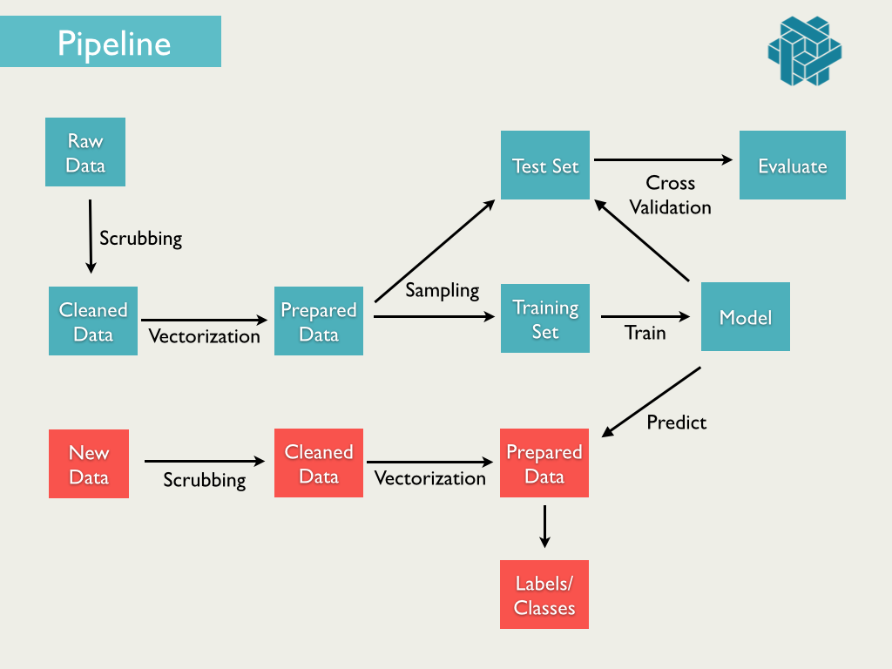

## Overview

For this competition we will be attempting to classify whether a page is "evergreen" or not.  The Kaggle competition can be found here: [http://www.kaggle.com/c/stumbleupon](http://www.kaggle.com/c/stumbleupon).

Feature extraction/engineering is one of the more subjective aspects of ML and often depends on experimentation and domain knowledge.  It is here that we will hopefully learn some of its art.

__HTML -> Text -> Tokens -> bag-of-words vector -> features -> ALGORITHMS! -> $$$__

## Rules

We will be using the Kaggle submission/grading for this competition.  Follow the rules  and get the data here: [http://www.kaggle.com/c/stumbleupon/data](http://www.kaggle.com/c/stumbleupon/data).  We (Kaggle) will use [this](http://www.kaggle.com/c/stumbleupon/details/evaluation) metric (AUC) to score your submission.

## Some Reading

* [Finding Important words with tf-idf](http://www.stevenloria.com/finding-important-words-in-a-document-using-tf-idf/)
* [Text classification with NLTK and scikit-learn (slides)](http://www.slideshare.net/ogrisel/statistical-machine-learning-for-text-classification-with-scikitlearn-and-nltk)

### References

* [Data Pipelines in Python](http://columbia-applied-data-science.github.io/appdatasci.pdf#page=29)
* Agile Data Science: Chapter 1 (Data Pipelines)

### Resources

* __[Requests HTTP library](http://docs.python-requests.org/en/latest/)__
* __[wget](http://www.gnu.org/software/wget/)__ is your friend. __[curl](http://curl.haxx.se/)__ is your homie. 
* __[Regular expression tester](http://pythex.org/)__
* __[Google Regex tutorial](https://developers.google.com/edu/python/regular-expressions)__
* __[Beautiful Soup (HTML parsing and searching)](http://www.crummy.com/software/BeautifulSoup/)__
* __[boilerpipe](https://github.com/misja/python-boilerpipe)__ article extraction
* [NLTK Book: 3.7 Toeknizing Text](http://nltk.org/book/ch03.html)
* [scikit-learn: Text Feature extraction](http://scikit-learn.org/stable/modules/feature_extraction.html#text-feature-extraction)
* [NLTK book](http://nltk.org/book/)

## Iterate

Our basic stages will be the following:

1. Ingest: downloading data, scraping the web, etc.
2. Munging: data cleaning, tokenization, null value handling, etc.
3. Featurization: bag-of-words, ngrams, binning, etc.
4. Training/Modeling
5. Testing/Validating
6. Predicting/$$$

We have already done most of these stages in various parts of the course.  This exercise will be focused on combining all of them and streamlining the process.  

Remember first get a baseline model, so you can begin to iterate on it with more complicated features.  Try adding methods to your scripts for different models, transformations, and feature engineering.  Here are some things to try:

### Some Experiments

1. tf-idf weighting
2. Inspecting CPT tables
3. N-grams
3. Chi-Squared feature selection
4. High information Features (Mutual Information)
5. Hashing Trick (Zipf's Law)
6. Custom Handcrafted Features
7. Biased classes?

### tf-idf

Our first (and most basic) form of engineering our features will be term frequency-inverse document frequency [tf-idf](https://en.wikipedia.org/wiki/Tf%E2%80%93idf) weighting.  It is a short hop away from a bag.  We basically need to add weights to our counts based on the total occurrence of words across all articles.

#### [Feature Selection](http://nlp.stanford.edu/IR-book/html/htmledition/feature-selection-1.html)
* CPT Tables (Naive Bayes): Look at your model's CPT tables to find word importances for a class
* [Chi-Squared](http://nlp.stanford.edu/IR-book/html/htmledition/feature-selectionchi2-feature-selection-1.html)
* [Mutual Information](http://nlp.stanford.edu/IR-book/html/htmledition/mutual-information-1.html)
* [Pointwise Mutual Information](http://stackoverflow.com/questions/13488817/pointwise-mutual-information-on-text)

#### Feature engineering
* [N-Grams](http://locallyoptimal.com/blog/2013/01/20/elegant-n-gram-generation-in-python/)
* [Hashing Trick](http://blog.someben.com/2013/01/hashing-lang/)
* Handcrafted Features: incorporate meta-data (author, date, total word count, etc.), include sentiment, domain knowledge, etc.

#### [Vector Space Model](http://nlp.stanford.edu/IR-book/html/htmledition/the-vector-space-model-for-scoring-1.html) (and similarity)
* [Cosine Similarity](http://nlp.stanford.edu/IR-book/html/htmledition/dot-products-1.html)
